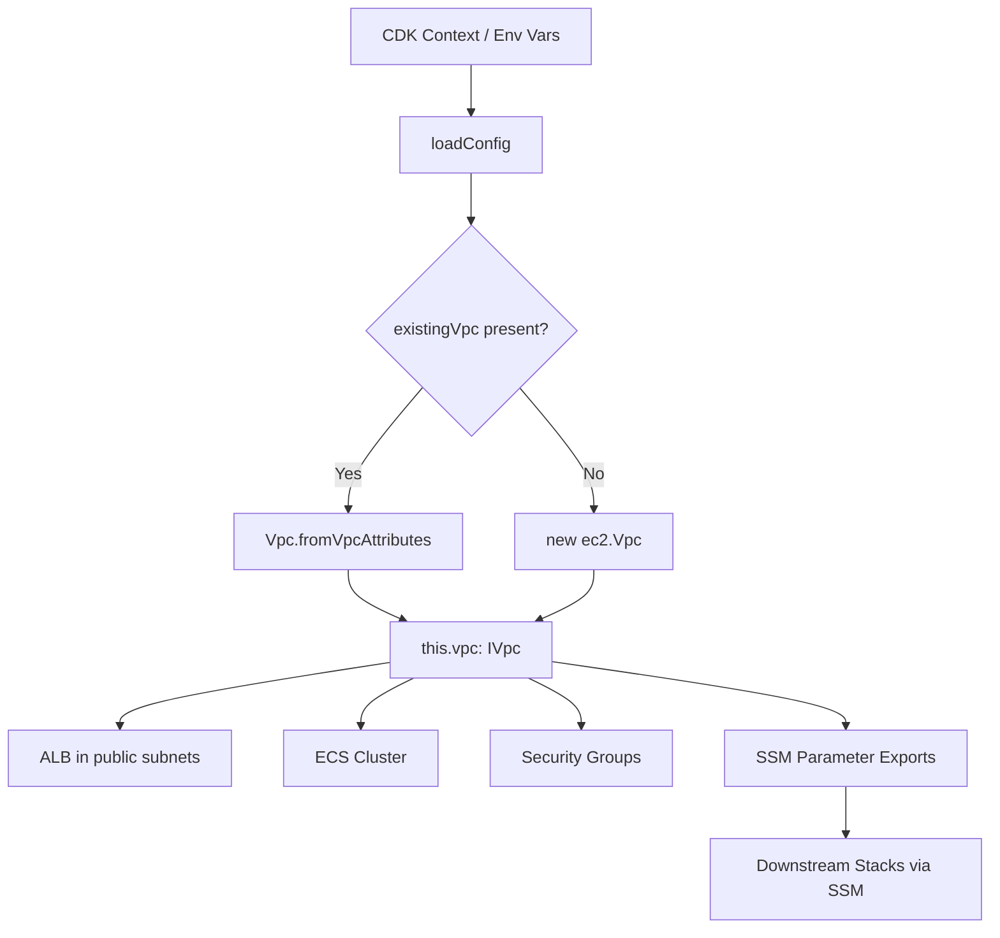
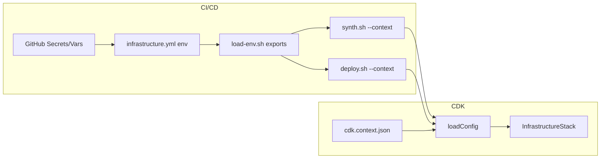

# Design Document: Existing VPC Support

## Overview

This feature introduces an optional `existingVpc` configuration block that allows the InfrastructureStack to import a pre-existing VPC via `Vpc.fromVpcAttributes()` instead of always creating a new one. The change is confined to two files (`config.ts` and `infrastructure-stack.ts`) plus CI/CD script updates. Downstream stacks require zero changes because they already consume network resources exclusively through SSM parameters.

The design follows a "branch at config, converge before use" pattern: the VPC creation vs. import decision is made once, early in the constructor, and the resulting `IVpc` reference is assigned to `this.vpc` so that all downstream resource creation (ALB, ECS Cluster, security groups, SSM exports) proceeds identically regardless of the VPC's origin.

### Key Design Decisions

1. **`IVpc` over `Vpc`**: The `this.vpc` property type changes from `ec2.Vpc` to `ec2.IVpc` (the interface). `Vpc.fromVpcAttributes()` returns `IVpc`, not `Vpc`. This is the standard CDK pattern for imported resources and is compatible with all downstream consumers (ALB, ECS, security groups).

2. **Validation at config load time**: All existing VPC field validation (regex patterns, array lengths, count matching) happens inside `loadConfig()` so that misconfigurations fail at `cdk synth` time, not at deploy time.

3. **Environment variable precedence**: Existing VPC fields follow the same `env var > CDK context` precedence pattern used by every other config property in the project.

4. **VPC CIDR bypass**: When `existingVpc` is present, the `vpcCidr` validation is skipped because it's only used for VPC creation.

## Architecture



### Configuration Flow



## Components and Interfaces

### 1. ExistingVpcConfig Interface

New TypeScript interface added to `config.ts`:

```typescript
export interface ExistingVpcConfig {
  vpcId: string;                // e.g. "vpc-0abc123def456"
  availabilityZones: string[];  // e.g. ["us-west-2a", "us-west-2b"]
  publicSubnetIds: string[];    // e.g. ["subnet-aaa", "subnet-bbb"]
  privateSubnetIds: string[];   // e.g. ["subnet-ccc", "subnet-ddd"]
  vpcCidrBlock?: string;        // e.g. "10.0.0.0/16" (optional)
}
```

### 2. AppConfig Extension

The `AppConfig` interface gains one optional field:

```typescript
export interface AppConfig {
  // ... existing fields ...
  existingVpc?: ExistingVpcConfig;
}
```

### 3. loadConfig() Changes

The `loadConfig()` function is extended to:

1. Read `existingVpc` fields from environment variables (`CDK_EXISTING_VPC_*`) with fallback to CDK context (`existingVpc.*`).
2. If any existing VPC fields are present, assemble and validate an `ExistingVpcConfig` object.
3. Skip `vpcCidr` validation when `existingVpc` is present.

### 4. validateExistingVpcConfig() Function

New validation function called from `validateConfig()` when `existingVpc` is defined:

```typescript
function validateExistingVpcConfig(config: ExistingVpcConfig): void {
  // 1. vpcId matches /^vpc-[a-z0-9]+$/
  // 2. availabilityZones.length between 2 and 6
  // 3. publicSubnetIds.length >= 2, each matches /^subnet-[a-z0-9]+$/
  // 4. privateSubnetIds.length >= 2, each matches /^subnet-[a-z0-9]+$/
  // 5. publicSubnetIds.length === availabilityZones.length
  // 6. privateSubnetIds.length === availabilityZones.length
}
```

### 5. InfrastructureStack VPC Branch

The VPC creation section of the constructor becomes:

```typescript
if (config.existingVpc) {
  this.vpc = ec2.Vpc.fromVpcAttributes(this, 'ImportedVpc', {
    vpcId: config.existingVpc.vpcId,
    availabilityZones: config.existingVpc.availabilityZones,
    publicSubnetIds: config.existingVpc.publicSubnetIds,
    privateSubnetIds: config.existingVpc.privateSubnetIds,
  });
} else {
  this.vpc = new ec2.Vpc(this, 'Vpc', { /* existing config */ });
}
```

The `this.vpc` type changes from `ec2.Vpc` to `ec2.IVpc`.

### 6. SSM Export Adjustments

For the VPC CIDR SSM parameter, the value source depends on the path taken:

- **Imported VPC with `vpcCidrBlock`**: Use `config.existingVpc.vpcCidrBlock`
- **Imported VPC without `vpcCidrBlock`**: Use `this.vpc.vpcCidrBlock` (CDK token)
- **Created VPC**: Use `this.vpc.vpcCidrBlock` (same as today)

For subnet IDs and AZs with an imported VPC, the values come directly from the config (since `fromVpcAttributes` stores them):

```typescript
const privateSubnetIds = config.existingVpc
  ? config.existingVpc.privateSubnetIds.join(',')
  : this.vpc.privateSubnets.map(s => s.subnetId).join(',');
```

### 7. CI/CD Script Changes

**load-env.sh**: Add exports for `CDK_EXISTING_VPC_ID`, `CDK_EXISTING_VPC_AZS`, `CDK_EXISTING_VPC_PUBLIC_SUBNET_IDS`, `CDK_EXISTING_VPC_PRIVATE_SUBNET_IDS`, `CDK_EXISTING_VPC_CIDR`. Add corresponding `build_cdk_context_params` entries that assemble the nested `existingVpc.*` context keys.

**synth.sh / deploy.sh**: Add conditional `--context existingVpc.*` parameters when the environment variables are set.

**infrastructure.yml**: Add `CDK_EXISTING_VPC_*` environment variables sourced from GitHub Variables.

## Data Models

### ExistingVpcConfig

| Field | Type | Required | Validation | Source (env var) | Source (context) |
|---|---|---|---|---|---|
| `vpcId` | `string` | Yes | `/^vpc-[a-z0-9]+$/` | `CDK_EXISTING_VPC_ID` | `existingVpc.vpcId` |
| `availabilityZones` | `string[]` | Yes | 2–6 entries | `CDK_EXISTING_VPC_AZS` (comma-separated) | `existingVpc.availabilityZones` |
| `publicSubnetIds` | `string[]` | Yes | ≥2 entries, each `/^subnet-[a-z0-9]+$/` | `CDK_EXISTING_VPC_PUBLIC_SUBNET_IDS` (comma-separated) | `existingVpc.publicSubnetIds` |
| `privateSubnetIds` | `string[]` | Yes | ≥2 entries, each `/^subnet-[a-z0-9]+$/` | `CDK_EXISTING_VPC_PRIVATE_SUBNET_IDS` (comma-separated) | `existingVpc.privateSubnetIds` |
| `vpcCidrBlock` | `string` | No | CIDR format if provided | `CDK_EXISTING_VPC_CIDR` | `existingVpc.vpcCidrBlock` |

### AppConfig Change

```typescript
// Added field
existingVpc?: ExistingVpcConfig;
```

### InfrastructureStack Property Change

```typescript
// Before
public readonly vpc: ec2.Vpc;

// After
public readonly vpc: ec2.IVpc;
```

### cdk.context.json Example

```json
{
  "existingVpc": {
    "vpcId": "vpc-0abc123def456",
    "availabilityZones": ["us-west-2a", "us-west-2b"],
    "publicSubnetIds": ["subnet-pub1", "subnet-pub2"],
    "privateSubnetIds": ["subnet-priv1", "subnet-priv2"],
    "vpcCidrBlock": "10.0.0.0/16"
  }
}
```


## Correctness Properties

*A property is a characteristic or behavior that should hold true across all valid executions of a system — essentially, a formal statement about what the system should do. Properties serve as the bridge between human-readable specifications and machine-verifiable correctness guarantees.*

### Property 1: Config round-trip from CDK context

*For any* valid `ExistingVpcConfig` object (with valid vpcId, 2–6 AZs, matching subnet counts, valid subnet IDs), when set as CDK context and loaded via `loadConfig()`, the returned `config.existingVpc` should contain the same `vpcId`, `availabilityZones`, `publicSubnetIds`, `privateSubnetIds`, and `vpcCidrBlock` values.

**Validates: Requirements 1.1, 1.3, 8.1**

### Property 2: Config round-trip from environment variables

*For any* valid `ExistingVpcConfig` object, when its fields are set as `CDK_EXISTING_VPC_*` environment variables (with arrays as comma-separated strings) and loaded via `loadConfig()`, the returned `config.existingVpc` should contain the same values.

**Validates: Requirements 1.4**

### Property 3: Environment variable precedence over CDK context

*For any* two distinct valid `ExistingVpcConfig` objects A and B, when A is set via environment variables and B is set via CDK context, `loadConfig()` should return the values from A (environment variables win).

**Validates: Requirements 8.2**

### Property 4: Invalid field rejection

*For any* `ExistingVpcConfig` where at least one field violates its validation rule (vpcId not matching `vpc-[a-z0-9]+`, AZ count outside [2,6], subnet IDs not matching `subnet-[a-z0-9]+`, or fewer than 2 public/private subnets), `loadConfig()` should throw an error.

**Validates: Requirements 2.1, 2.2, 2.3, 2.4**

### Property 5: Subnet count must match AZ count

*For any* `ExistingVpcConfig` where the number of `publicSubnetIds` or `privateSubnetIds` does not equal the number of `availabilityZones`, `loadConfig()` should throw an error.

**Validates: Requirements 2.5, 2.6**

### Property 6: Imported VPC skips VPC creation and preserves downstream resources

*For any* valid `ExistingVpcConfig`, when the InfrastructureStack is synthesized with that config, the resulting CloudFormation template should contain zero `AWS::EC2::VPC` resources, zero `AWS::EC2::Subnet` resources, zero `AWS::EC2::NatGateway` resources, and should still contain an `AWS::ElasticLoadBalancingV2::LoadBalancer`, an `AWS::ECS::Cluster`, and at least one `AWS::EC2::SecurityGroup`.

**Validates: Requirements 3.1, 3.2, 5.2, 5.3, 5.4**

### Property 7: SSM network parameter completeness

*For any* valid `ExistingVpcConfig`, when the InfrastructureStack is synthesized, the CloudFormation template should contain SSM parameters for `vpc-id`, `private-subnet-ids`, `public-subnet-ids`, `availability-zones`, and `vpc-cidr` — the same set of network SSM parameters produced when creating a new VPC.

**Validates: Requirements 4.1, 4.2, 4.3, 4.4, 4.5**

### Property 8: vpcCidr validation bypass for imported VPCs

*For any* valid `ExistingVpcConfig` and any `vpcCidr` value (including empty string or invalid CIDR), `loadConfig()` should not throw a VPC CIDR validation error when `existingVpc` is present.

**Validates: Requirements 6.1**

## Error Handling

| Scenario | Behavior | Error Message Pattern |
|---|---|---|
| `vpcId` doesn't match `vpc-[a-z0-9]+` | `loadConfig()` throws | `"Invalid existingVpc.vpcId: ... Expected format: vpc-[a-z0-9]+"` |
| `availabilityZones` has <2 or >6 entries | `loadConfig()` throws | `"existingVpc.availabilityZones must contain between 2 and 6 entries"` |
| `publicSubnetIds` has <2 entries | `loadConfig()` throws | `"existingVpc.publicSubnetIds must contain at least 2 entries"` |
| `privateSubnetIds` has <2 entries | `loadConfig()` throws | `"existingVpc.privateSubnetIds must contain at least 2 entries"` |
| Subnet ID doesn't match `subnet-[a-z0-9]+` | `loadConfig()` throws | `"Invalid subnet ID: ... Expected format: subnet-[a-z0-9]+"` |
| Public subnet count ≠ AZ count | `loadConfig()` throws | `"existingVpc.publicSubnetIds count (N) must equal availabilityZones count (M)"` |
| Private subnet count ≠ AZ count | `loadConfig()` throws | `"existingVpc.privateSubnetIds count (N) must equal availabilityZones count (M)"` |
| `existingVpc` absent, `vpcCidr` invalid | `loadConfig()` throws | Existing CIDR validation error (unchanged) |
| `existingVpc` present, `vpcCidr` invalid | No error | Validation skipped |
| Partial env vars (e.g. VPC ID set but no subnets) | `loadConfig()` throws | Validation catches missing required fields |

All validation errors are thrown at synth time (during `loadConfig()`), never at deploy time. This follows the existing project pattern where `validateConfig()` catches misconfigurations early.

## Testing Strategy

### Unit Tests (Jest)

Unit tests cover specific examples and edge cases:

- `existingVpc` absent → `config.existingVpc` is `undefined` (Req 1.2)
- Default VPC creation path unchanged when `existingVpc` absent (Req 3.3)
- VPC CIDR validation still enforced when `existingVpc` absent (Req 6.2)
- SSM CIDR parameter uses `vpc.vpcCidrBlock` when `existingVpc` omits `vpcCidrBlock` (Req 4.6)
- Error messages contain the failing field name (Req 2.7)
- Stack synth produces correct resource counts for both paths

### Property-Based Tests (fast-check)

The project currently uses Jest for testing. Property-based tests will use [fast-check](https://github.com/dubzzz/fast-check) as the PBT library, which integrates natively with Jest via `fc.assert(fc.property(...))`.

Each property test must:
- Run a minimum of 100 iterations
- Reference its design document property in a comment tag
- Use custom arbitraries to generate valid/invalid `ExistingVpcConfig` objects

**Tag format**: `Feature: existing-vpc-support, Property {N}: {title}`

**Custom Arbitraries needed**:
- `validVpcId()`: generates strings matching `vpc-[a-z0-9]+`
- `validSubnetId()`: generates strings matching `subnet-[a-z0-9]+`
- `validAzList(n)`: generates arrays of n valid AZ strings
- `validExistingVpcConfig()`: composes the above into a complete valid config
- `invalidVpcId()`: generates strings NOT matching the pattern
- `invalidSubnetId()`: generates strings NOT matching the pattern

**Property test → design property mapping**:

| Test | Design Property | Min Iterations |
|---|---|---|
| Config round-trip from context | Property 1 | 100 |
| Config round-trip from env vars | Property 2 | 100 |
| Env var precedence | Property 3 | 100 |
| Invalid field rejection | Property 4 | 100 |
| Subnet-AZ count mismatch | Property 5 | 100 |
| Imported VPC skips creation | Property 6 | 100 |
| SSM parameter completeness | Property 7 | 100 |
| vpcCidr bypass | Property 8 | 100 |

**Note**: Properties 6 and 7 involve CDK stack synthesis which is relatively slow. For these, 100 iterations may be adjusted down if synthesis time becomes prohibitive, but the minimum target is 100.

**Dependency**: `fast-check` must be added as a dev dependency to `infrastructure/package.json`.
