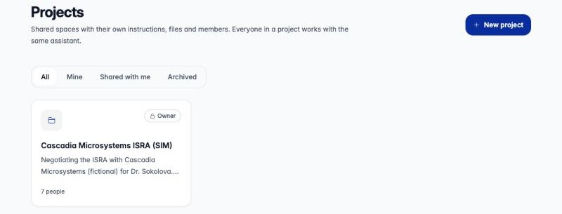
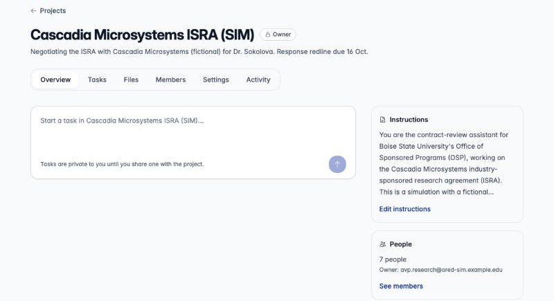

A **project** is a shared workspace for a team that works on the same thing,
such as a contract negotiation, a grant proposal or a course redesign. Everyone in
the project works with **the same assistant**: one set of instructions, one set of
files, one set of tools, and a memory the whole team can build up.

Use a project when two or more people keep asking an assistant about the same
documents, or keep re-explaining the same ground rules. Set it up once, and
every member's conversations start from the same place.

:::note[Is it turned on?]
Projects are opt-in for each deployment. If you don't see **Projects** in the
sidebar menu, or `/projects` shows a "not found" page, ask your administrator.
:::

## What's shared and what's yours

| Shared with everyone in the project | Private to you |
| --- | --- |
| The assistant's **instructions**, **model**, **tools** and **skills** | Your **tasks** (conversations) until you share one |
| The project's **files** | Files you attach to one of your tasks |
| **Project memory** the team builds up | Your **"just for me"** memory in this project |
| Tasks someone has **shared with the project** | Your **personal instructions** (Settings › Chat) |
| The member list and, for editors, the **Activity** trail | Files the assistant creates for you in a task |

Each conversation you start in a project is called a **task**. A task is
private until you share it. Sharing posts a read-only **snapshot**, and teammates
can pick it up as a copy in a task of their own.

## Roles

Everyone in a project has one role. People are added by email, so you can add a
colleague before they have ever signed in. The project is waiting for them
when they do.

| | Viewer | Editor | Owner |
| --- | :---: | :---: | :---: |
| Open the project, its files and shared tasks | ✓ | ✓ | ✓ |
| Start tasks with the project's assistant | ✓ | ✓ | ✓ |
| Share their own tasks with the project | ✓ | ✓ | ✓ |
| Download files | ✓ | ✓ | ✓ |
| Save things to their own "just for me" memory | ✓ | ✓ | ✓ |
| Add and delete files | | ✓ | ✓ |
| Save to project memory (through the assistant) | | ✓ | ✓ |
| Change instructions, model, tools and skills | | ✓ | ✓ |
| Rename the project, edit its description | | ✓ | ✓ |
| Add, remove and change members | | ✓ *(unless the owner turns this off)* | ✓ |
| See the Activity trail | | ✓ | ✓ |
| Archive, restore, delete, transfer ownership | | | ✓ |

- **There is exactly one owner.** The owner can hand the project to an editor,
  who must have signed in at least once (they don't need to have opened the
  project). The old owner becomes an editor.
- **Anyone except the owner can leave** a project from the Members tab.
- **Picking roles:** make people who shape the work *editors* (they set the
  assistant up and curate files). Make people who mainly need answers, such as
  reviewers, stakeholders and advisors, *viewers*. Viewers can still start
  tasks and share them.

## The project page

Every project has six tabs:

| Tab | What it's for |
| --- | --- |
| **Overview** | Start a task, and see the instructions and who's in the project |
| **Tasks** | Your own tasks in the project, and everything shared with it |
| **Files** | The documents the assistant works from |
| **Members** | People, roles and invitations |
| **Settings** | Name, instructions, model, tools, skills, history, owner controls |
| **Activity** | Who changed what, newest first *(editors and owner only)* |

Project tasks also appear in the main sidebar, grouped under a small heading
with the project's name.

## Next steps

- [Set up a project](/agentcore-public-stack/user-guide/projects/set-up/): create it,
  write instructions, add files and invite your team.
- [Work together](/agentcore-public-stack/user-guide/projects/work-together/): tasks,
  sharing, memory, attachments and Word documents.
- [Example: negotiating a research agreement](/agentcore-public-stack/user-guide/projects/example-contract-negotiation/):
  a full walkthrough with a seven-person team.
- [Tips and current limits](/agentcore-public-stack/user-guide/projects/tips-and-limits/).
