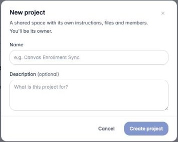
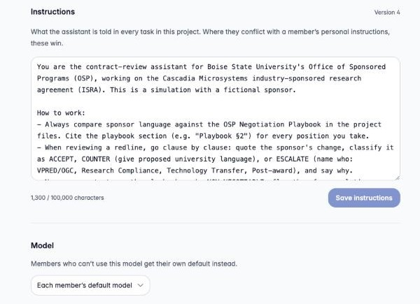
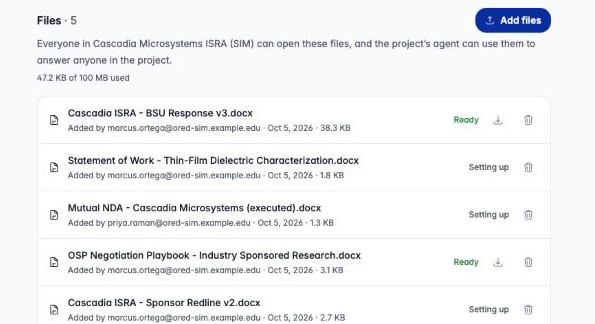
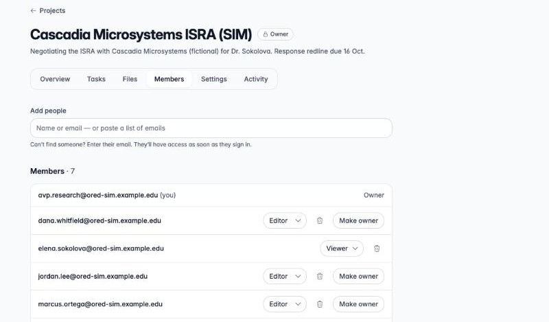
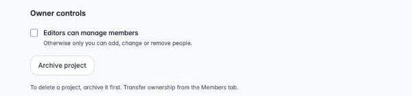

Setting up a project takes about ten minutes. Most of that is writing good
instructions, and that time pays back on every task anyone runs in the project.

## 1. Create the project

Open **Projects** and choose **New project**. Give it a name people will
recognize in the sidebar, and a one-line description of the goal. You become
its **owner**.



## 2. Write the instructions

Open **Settings › Instructions**. Instructions are what the assistant is told at
the start of *every* task, for *every* member. Treat them as a standing brief:
who the assistant works for, which documents are authoritative, how answers
should be laid out, and what it must never do.

A good brief covers four things:

1. **Role and context.** "You are the contract-review assistant for the Office
   of Sponsored Programs, working on the Cascadia research agreement."
2. **Sources of truth.** "Always compare sponsor language against the
   negotiation playbook in the project files, and cite the section."
3. **Output format.** "Go clause by clause. Classify each change as ACCEPT,
   COUNTER or ESCALATE, and give paste-ready contract language."
4. **Hard rules and routing.** "Never accept terms the playbook marks
   non-negotiable. Say who on the team should handle questions outside contract
   terms."



Every save that changes something becomes a new **version**. See
[History](/agentcore-public-stack/user-guide/projects/work-together/#settings-history-and-activity).

:::tip[Keep instructions about the project, not about people]
Write instructions for the whole team. Things that only apply to you, like
your role or your preferred format, belong in your
[personal instructions](/agentcore-public-stack/user-guide/projects/work-together/#your-role-and-preferences),
which ride along on every conversation you have.
:::

## 3. Choose a model, tools and skills

Still in **Settings**:

- **Model.** Leave it on *Each member's default model*, or pin one model for
  the whole team. Anyone who can't use the pinned model gets their own
  default instead.
- **Tools.** Turn on only what the work needs. Each tool's description is
  shown, and you can only add tools you can use yourself. Useful
  combinations:
  - *Contract or policy work:* **Word Documents** (so the assistant can produce
    a redlined `.docx`), **Policy Search**, **Clarifying Questions**.
  - *Budgets and numbers:* **Calculator**, **Analyze Spreadsheet**, **Excel
    Spreadsheets**.
  - *Reports and briefings:* **Word Documents**, **PowerPoint Presentations**,
    **Charts & Graphs**.
- **Skills.** Add any skills the team relies on.

If a member doesn't have access to one of the project's tools, skills, its model
or its memory, their tasks still run without it, and a notice above the
composer says what was left out.

## 4. Add the files the assistant should work from

Open **Files** and choose **Add files**. PDF, Word, PowerPoint, Excel, CSV,
Markdown, HTML and plain text are accepted. Everyone in the project can open
these files, and the assistant searches them to answer *anyone* in the project.
The page reminds you how many people that is.



Each file shows who added it and a status:

- **Setting up / Uploading**: the file is being prepared. The assistant can't
  use it yet.
- **Ready**: the assistant can search it.

A project's first upload also creates its search index, so the first files can
take a little longer than later ones. Files added together are prepared side by
side, and are usually **Ready** within a few minutes.

What to put in Files:

- **Reference material everyone needs**: playbooks, policies, templates,
  executed agreements, the statement of work.
- **Redlines the whole team works from**, such as the other side's latest
  draft. See [Word redlines in Files](#word-redlines-in-files).
- **One current version** of each document. Delete superseded drafts so the
  assistant doesn't quote an old one.

### Word redlines in Files

The assistant reads files as plain text. When a Word document has **tracked
changes**, each change is written out with a marker before the file is
indexed, so the assistant can tell what the author struck from what they added:

```text
…a fixed price of $184,500, [deleted: fifty percent (50%) upon execution …
net thirty (30) days][inserted: payable in full within ninety (90) days after
Sponsor's written acceptance …]
```

A note at the top of the indexed text names the authors of the changes and
explains that keeping the insertions and dropping the deletions gives the
proposed text, so you can ask for either reading. Word comments in a redline
are kept too, as `[comment by <author>: …]` at the point they refer to.
Formatting-only changes aren't marked.

:::caution[Redlines added before October 2026]
A redline added to Files before tracked changes were supported keeps its old,
flattened text: deleted and inserted wording run together with nothing to tell
them apart. If the assistant quotes a redline that way, delete the file and
upload it again.
:::

## 5. Invite your team

Open **Members**. In **Add people**, type a name or email, or paste a list of
emails, and pick a role. Invalid addresses and people who are already members
are reported back to you. Anyone you add gets a notification (the bell next to
your name in the sidebar), and the project appears in their Projects list.



- Change a role with the role picker next to a person's name, or remove them
  with the trash icon.
- By default, **editors can manage members too**. To keep that to yourself,
  clear **Settings › Owner controls › Editors can manage members**.



## 6. Seed the project memory

Before the team starts, give the assistant the facts everyone should share: key
dates, who owns which part, decisions already made. Start a task and ask:

> Please record these kickoff facts in the shared project memory so everyone on
> the team sees them: our response is due 16 October; Marcus drafts the
> response; Priya owns export control; Tom owns IP.

The assistant saves them and adds a line to the project memory index, which is
what every teammate's task starts from. See
[Project memory](/agentcore-public-stack/user-guide/projects/work-together/#project-memory).
