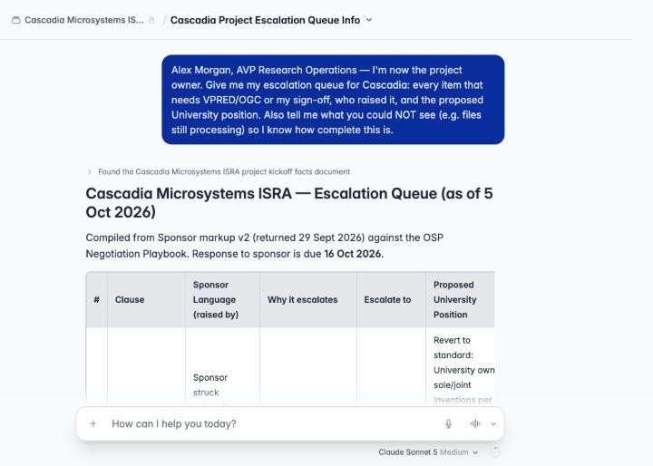
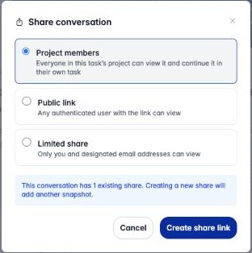
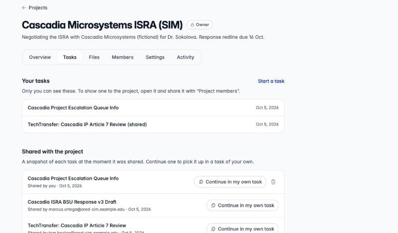
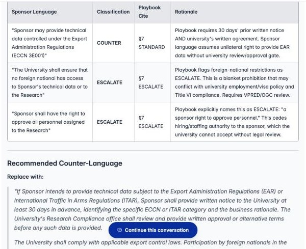
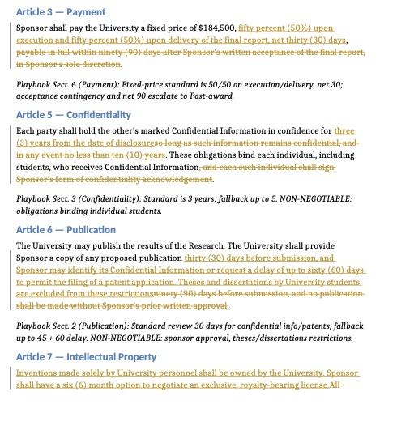
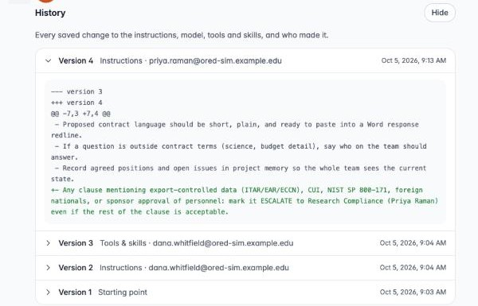
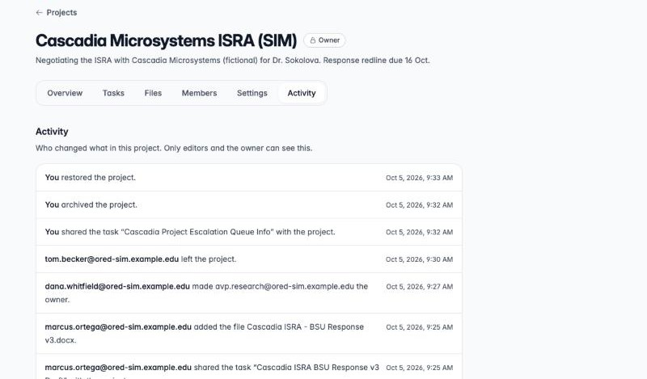
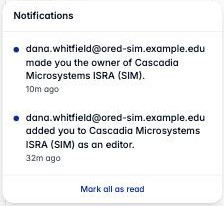
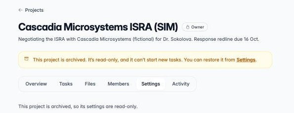

## Start a task

Type in the composer on the project's **Overview** tab, or choose **Start a
task** on the **Tasks** tab. The task runs on the project's assistant, with the
project's instructions, files, tools and memory, and appears in your sidebar
under the project's name. The breadcrumb at the top of the task shows which
project it belongs to.

**Your tasks are private.** Nobody else in the project, including the owner, can
see them until you share one.

:::note[Switching models starts a new task]
Picking a different model from the model menu inside a task starts a **new
task in the same project**, on the project's assistant. The conversation so far
stays in the old task and doesn't come along. The menu says this before you
choose. If the project pins a model in **Settings › Model**, the menu is locked
to it; change it there to use a different model for the whole team.
:::

### Your role and preferences

The project assistant knows which member is talking to it: your name, email
and project role come with every message you send, so it can tell you apart
from the teammates named in the project's instructions.

It doesn't know your job, though. To tell it what you do and how you like
answers laid out, set **Settings › Chat › Personal instructions** once:

> I'm the export control and research security specialist in Research
> Compliance. I review ITAR/EAR, CUI and foreign-national clauses. Format
> findings as a table: Issue | Risk | Recommended language.

Personal instructions (up to 4,000 characters) are added to every conversation
you have, in every project. Where they conflict with a project's
instructions, the project's win.

## Attach a file to a task

Use **+** in the composer to attach a file to *your* task. Attachments are
private to that task. They aren't added to project Files and other members'
assistants can't see them.

Attach rather than upload when:

- It's a **one-off** (an email thread, a draft you're not ready to share).
- Only **you** need it. Anything in Files is searched for everyone's tasks.
- The project's files are still **Setting up** and you need an answer now.

Both work for a **redline with tracked changes**: the assistant can quote what
the other side struck and what they added, whether the redline is attached or
in [Files](/agentcore-public-stack/user-guide/projects/set-up/#word-redlines-in-files).
Put it in Files when the whole team is working from it.

## Share a task with the project

Open the task's menu (the chevron next to its title), choose **Share**, and pick
**Project members**.

- A share is a **snapshot**: messages you add later aren't included. Share
  again to update it. A new project share replaces the old entry, so the task
  is listed once.
- Shared tasks appear on everyone's **Tasks** tab under **Shared with the
  project**, with who shared them and when.
- To stop sharing, use the trash icon next to a task you shared.

### Let people know

Sharing tells nobody unless you ask it to. Under **Let people know**, choose
**Everyone** to notify every member, or **Choose people** to pick members from
a list. You can only notify people already in the project.

Add a **note** (up to 280 characters) to say what you need, such as "Can you
check the spring dates?" The note appears under the task in **Shared with the
project** and in the notification. Sharing the task again replaces the note
along with the snapshot.

**Public link** and **Limited share** are also offered. They share the task
outside the project, so think twice before using them for project work.

## Share an output with the project

When the assistant makes an artifact in a project task, such as a chart, a web
page or a CSV, you can share that artifact with the project on its own, without
sharing the whole task. Open the artifact's **Share** menu and pick **Project
members**.

- It appears under **Outputs** on the project page, between the composer and
  your recent tasks, and every member can open it.
- A share shows one version. Sharing a newer version replaces the one listed.
- To take it off the project, use the ✕ on its card. Editors can remove anyone's
  output; everyone else can remove only their own.
- People removed from the project lose access to its outputs too.

## Pick up someone else's work

Open a shared task to read its snapshot.

You can also ask the assistant. In any task in the project it can list the tasks
members have shared and read them, so "what escalations are still open?" covers
shared work as well as Files and project memory. It reads the snapshot each
person shared: what they asked and what the assistant answered, without tool
results or attachments. It only sees what's shared with the project, never
anyone's private tasks.

To build on it, choose **Continue in my own task**. You get your own copy of the
conversation, still in the project and on the project's current assistant, and
the original is untouched. The assistant sees the copied conversation from your
first message, and the copy shows what the original author typed.

**Attachments aren't copied.** They belong to the person who shared the task.
Where the original had one, the copy says which files weren't copied. Attach
your own copy of any you need, or ask the person who shared the task to add it
to Files.

## Project memory

The assistant can remember things across tasks, at two levels:

| | **Project memory** | **Just for me** |
| --- | --- | --- |
| Who it's for | Everyone in the project | Only you, only in this project |
| Who can save to it | Editors and the owner | Any member |
| Good for | Deadlines, owners, agreed positions, open issues | Your formatting preferences, your own working notes |
| How to ask | "Record in **project memory** that…" | "Remember **for me** (not the team) that…" |

How it reaches other people's tasks: each memory has a short **index**, and the
index is what the assistant sees at the start of every task. Detailed entries
are only read when the assistant goes looking. When the assistant saves a new
memory, it adds a line for it to the index automatically, so you only need to
say what to record:

> Record our agreed Article 3 payment position in project memory.

"Just for me" memory works the same way. Ask the assistant to remember a
preference **for you** and it's saved and applied in your next task in this
project:

> Remember this just for me, not the team: when I ask for a status check, reply
> with one line per open article.

Other useful requests:

- "What's in project memory?" or "List the project memory files." (You can
  also browse it yourself; see below.)
- "Update the open-issues note: the indemnification clause is resolved."
- "In the Article 6 note, replace the 90-day review item. It's out of date."
  (The assistant edits a memory file by rewriting it. It can't delete a file
  outright.)

:::caution[Check what gets saved]
Project memory is shared with everyone. When an editor saves to it, the change
takes effect at once. If the assistant gets something wrong, such as a misread
clause or a math error, and saves it, every teammate's assistant will repeat it.
Ask the assistant to read back what it saved, and correct it straight away.
:::

### Browse memory

Open **Memory** in the project's settings, beside Files. Two tabs at the top
switch between **Project** memory and your own (**Just me**). Each lists the
**Index** first, because it's what every task sees, and then the files.

Open a file to see its items. Under each item is who added it and how: saved by
the assistant from someone's task, proposed and approved, or edited directly.
When it came from one of your own tasks, you can open that task from there.
Words in double square brackets, like `[[deadlines]]`, link to other files.

The bar beside each file shows its size against the limit for one file
(8,000 tokens, roughly 6,000 words). It turns amber when a file is close, and a
change that would take a file over the limit is refused. The index has its own
bar: only about the first 2,000 tokens of the project index reach a task (1,000
for yours), so keep it to one short line per file.

### Edit memory yourself

Editors and the owner can change project memory on the Memory page, and anyone
can change their own (**Just me**):

- **Edit** on a file opens it with one box per item. Change the wording, add an
  item, remove one (it goes to the archive), or drag the handle to reorder. From
  the keyboard, the arrow keys move between handles and **Alt** with an arrow
  moves the item.
- The link button beside an item inserts a link to another file. Pick the file
  from the list; you can type to narrow it.
- **New file** asks for a short lowercase name, such as `deadlines`, plus a
  description that tells the assistant when to open it. The new file is added
  to the index for you, and a deleted file is taken out of it.
- **Edit index** changes the index itself.

The editor points out problems as you type, such as a link to a file that
doesn't exist or a name that's already taken. If someone else saved the same
file while you had it open, your save is refused so their change isn't lost.
Reload the file and make your change again.

### Pin an item

Editors and the owner can **pin** an item in project memory, and anyone can pin
items in their own. A pinned item can't be removed by any change, including one
the assistant makes, until a person unpins it. Pin the facts the whole project
depends on, such as a signed-off position or a hard deadline.

### Bring back a removed item

When an item is removed from a file, or its whole file is deleted, it goes to
the **Archive** on the Memory page. Items stay there for a year in project
memory and 30 days in yours. **Restore** puts an item back at the end of its
file, with its history, and recreates the file if it was deleted. Restoring
takes the same right as editing.

### See a file's history

**History** on a file lists every saved version: who saved it and how (edited
on the Memory page, saved by the assistant, approved from a proposal, or
restored). Pick a version to compare it with the file now. If you can edit the
file, **Restore** brings that version back as a new version, so nothing in the
history is lost and a restore can be undone the same way. Items that come back
keep their original history. A pinned item that the old version doesn't have
must be unpinned first.

### Propose a change

Viewers can't save to project memory directly. A viewer can **propose** a change
instead: on the Memory page, use **Propose a change** on a file or **Propose a
file**, or ask the assistant to "propose adding to project memory that…". The
proposal waits for review, and nothing changes until an editor or the owner
approves it. Editors can ask the assistant to propose too, when they want a
second look.

### Review proposed changes

Editors and the owner are notified of each proposal. The project page shows
**Proposed memory changes** above Recents when any are waiting; it, the
notification and **Review** on the Memory page all open the review queue. Pick a
proposal to see the file as it is and as proposed, side by side, with what it
adds and removes highlighted. Then **Approve** it, **Edit before approving**, or
**Decline** it, optionally with a note for the person who proposed it. They're notified of your decision either way. If someone changed the file
after the proposal was made, you'll need to edit the proposal against the current
file before you can approve it.

If you proposed a change, you'll see it under **Your proposals** on the Memory
page until it's decided, and you can **Withdraw** it.

### Tidy up memory

Over time a project's memory collects items that repeat each other, items a
newer one has replaced, and notes about meetings and deadlines that have passed.
Editors and the owner can ask the assistant to tidy it: **Tidy up** on the Memory
page reads every file, and the ✨ button on a file reads just that one. It takes
a few minutes, and you can leave the page while it runs.

The assistant only **suggests** changes. They wait in the review queue, and
memory doesn't change until an editor approves them. It suggests three kinds:

- **Merge** items that say the same thing into one. A merge keeps every number,
  date, link, name and reason its items had, and adds nothing new. The
  assistant's suggestion is checked for that before you see it.
- **Replace** an item that a newer one updates or contradicts.
- **Remove** an item whose dates have all passed, like a meeting that happened.

Pinned items are never removed. Each suggestion shows what it takes out and
why. Untick any you don't want, then **Apply** the rest. If someone edited the
file since the run, the edit is kept. Any suggestion that touches an edited item
is skipped, and the review says so. Items that leave go to the archive like any
other removed item, labelled with how they left, so you can bring one back.

#### Tidy up your own memory

Anyone in the project can tidy their own memory: open **Just me** and use
**Tidy up**, or the ✨ button on one of your files. It makes the same three kinds
of change, checked the same way, but there's no review queue: the changes are
saved as soon as the run ends, because nobody else's memory is affected.

When it finishes, the line under the buttons says how many changes it made, and
**What changed** lists them file by file. **Undo** puts your files back as they
were before the run, as new versions, so nothing in their history is lost. You
can undo for about a month (the line says until when). If you've changed a file
since the run, Undo leaves that file alone so your edit is kept, and says so.
Its **History** still has the version from before the tidy-up, and the archive
still has the items it took out, so you can bring those back yourself.

If you edit a file while the run is working on it, the run leaves that file
alone too.

## Ask for a Word redline

If the project has the **Word Documents** tool, the assistant can produce a
`.docx` with **real tracked changes**. Attach the other side's draft and say
what you want:

> Attached is Cascadia's v2 redline. Create "Cascadia ISRA – BSU Response v3.docx":
> start from their text and show our changes as tracked changes (author "Boise
> State OSP"), with a short italic note under each article citing the playbook
> section.

Open the file in Word and use **Review › Track Changes** to accept or reject
each change. The generated file is saved to **your task**, not the project:

- Download it from the task.
- Review it. The assistant can miss a clause or misstate a rule.
- Teammates can't open a file from your task, even after you share the task.
  To give the team and the assistant your draft, download it and add it to
  project Files. Its tracked changes stay readable there (see
  [Word redlines in Files](/agentcore-public-stack/user-guide/projects/set-up/#word-redlines-in-files)).
  Name it so it's clear it's your side's proposal.

## Settings history and Activity

Every saved change to instructions, model, tools or skills becomes a numbered
version. Open **Settings › History** and expand a version to see the change
and who made it.

To go back to an earlier version, copy the text from History into the editor and
save. That becomes a new version.

The **Activity** tab (editors and owner) lists who added people, changed roles,
added files, shared tasks, edited settings, archived or restored the project,
and left it.

## Notifications

The bell next to your name in the sidebar shows when someone:

- adds you to a project
- changes your role
- removes you
- makes you the owner
- archives or restores a project you're in
- leaves a project you own
- shares a task and chooses to notify you, with their note if they left one
- proposes a change to project memory, or decides on one you proposed
- runs memory maintenance that suggests changes for you to review

Opening a notification marks it read and takes you to the project (to
**Members** when someone left, and to the task itself when someone shared one).
If the task has since stopped being shared, the page says so. Notifications
expire after 90 days, and you're never notified about your own actions. New
files and setting changes don't notify anyone. Check **Activity**.

## Archive, restore, delete, transfer, leave

| Action | Who | Where | What happens |
| --- | --- | --- | --- |
| **Archive** | Owner | Settings › Owner controls | Read-only for everyone: no new tasks or messages, no file or setting changes. Files and shared tasks stay readable. Every member is notified. |
| **Restore** | Owner | Settings | Back to normal. Every member is notified. |
| **Delete** | Owner | Settings, archived projects only | Removes the project, its assistant, its files and its list of shared tasks. Each member keeps their own tasks as ordinary conversations. |
| **Transfer ownership** | Owner | Members › **Make owner** | Goes to an editor who has signed in at least once. The old owner becomes an editor, and the new owner is notified. |
| **Leave** | Anyone but the owner | Members › **Leave project** | You lose access, and the owner is notified. Tasks you shared stay listed for the team. |

