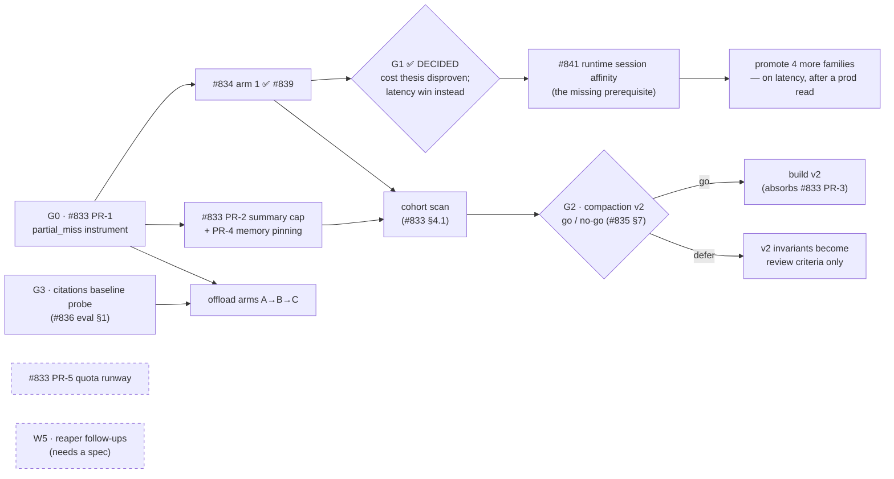

# Cost-Effectiveness Plan of Record

**For:** engineering · **Date:** August 5, 2026 · **Owner:** Phil Merrell
**Status:** living document — updated when a gate below is decided, a PR in the
arc merges, or a number moves. This is a *map*, not a fifth spec: each
workstream's authority lives in its own spec, and if this page disagrees with
a spec, the spec wins and this page gets fixed.

*Companion specs:* `compaction-over-threshold-cache-spiral.md` (#833) ·
`agent-cache-extra-tools-bypass.md` (#834) · `compaction-v2-versioned-prefix.md`
(#835) · `document-context-offload.md` + validation + evaluation (#836) ·
`quota-cooldown-windows.md` · `tool-search-token-bloat-strategy.md` ·
`session-workspace-tools.md` · `share-large-conversations-s3-offload.md`

---

## The tenet, restated as a plan

CLAUDE.md's token-cost tenet says: engineer against **waste**, never against
context, and verify — don't guess. The 2026 investigations turned that tenet
into measured findings: attachment conversations are 31% of model spend,
cold prefix re-writes ~25%, the fleet writes 2× what it reads from cache, and
one compaction spiral spent 90% of a user's monthly quota on cache re-writes.
Meanwhile the AICC platform report found **AgentCore Runtime memory is ~73% of
the total AWS bill** — the model-token arc below optimizes the *minority* of
spend, and the plan has to hold both levers in frame.

## North-star metrics (proposed — ratify at first review)

1. **Unexplained-waste share of model spend** = (partial-miss + avoidable-miss
   dollars, net of `agentSwitched` re-writes) ÷ total model spend. Today:
   still unknown, but no longer unmeasurable — #833 PR-1 built the instrument
   (`partial_miss` on every `C#` row, `PartialMiss`/`PartialMissUsd` EMF,
   `partialMissCount`/`partialMissUsd` session rollups). Baseline is the first
   full week of prod traffic after it deploys; note the numerator only counts
   calls written *after* deploy — nothing is backfilled, so the incident's own
   56 rows still read `hit`. Provisional target: **< 5%**. This is the number
   that says the *prefix-stability* and *payload* work is done.
2. **Cost per weekly-active-user, trend** — flat-or-down while usage grows.
   This is the number that says the platform scales. (Absolute totals are
   understated ~20% by legacy missing-cost rows — see the #836 validation —
   so trend, not level, is the signal.)
3. **Runtime-memory minutes per active session** — the infra lever's
   equivalent of metric 1. Baseline exists from the reaper work (post-#827
   microVM lifetimes 18–50 min vs 480–520 before).
4. **p50/p95 turn latency** (added 2026-08-05, when W6 appeared). Not
   originally here because this page was scoped to spend — but G1 found the
   platform paying a full `initialize()` on ~76% of turns, and cost-only
   metrics are blind to that. Dev baseline: ~7.5–8.1s unpinned vs ~3.1s
   pinned; prod baseline pending #841.

## Workstreams

| # | workstream | what it protects | authority | state |
|---|---|---|---|---|
| W1 | **Measurement** | every other row of this table | #833 PR-1 (`partial_miss`), cohort scan §4.1, dashboards #699/#700 | **PR-1 merged (#838) and live in dev**; prod awaits a release, and that is when the baseline clock starts. Cohort scan §4.1 next |
| W2 | **Prefix stability** | don't rewrite what didn't change | #833 PR-2/3/4 → #835 v2 (gated) | #833 PR-2/3/4 unbuilt. ⚠️ **#834 has left this row** — G1 disproved its prefix-cost thesis; it is a latency fix and now lives in W6 |
| W6 | **Turn latency** | time-to-answer, not tokens | #834 (bypass narrowing + family promotion) · #841 (runtime session affinity) | **#841 merged and verified in dev** — steady-state turns ~7.6s → ~3.9s. Split: warm container ~7.6→4.8s (all sessions), reused Agent ~4.8→3.9s (cacheable only). #839's treatment arm now equals the ceiling |
| W3 | **Payload boundedness** | nothing unbounded enters the prefix | #836 offload · tool-search strategy · workspace tools (PR-1 built) · S3 share-offload | offload PRs unbuilt; citations baseline probe required first |
| W4 | **Demand governance** | bound the blast radius of any failure | quota-cooldown spec · #833 PR-5 (earlier warnings, per-session notice) | drafted; PR-5 unbuilt |
| W5 | **Infrastructure economics** | the 73% of the bill that isn't tokens | reaper #827 (shipped) + open follow-ups: ~~session-id forwarding~~, `StopRuntimeSession` | session-id forwarding **done for a different reason** (#841, W6) — it was filed here as a reaper follow-up and turned out to be the binding constraint on the agent cache; `StopRuntimeSession` still un-specced — **gap** |

W4 is deliberately independent: it must protect users even when W1–W3 fail,
because the spiral incident showed a platform bug can spend a user's whole
quota (equity note: with a working cache that user's month was ~$10, not $30).

## Order of operations and decision gates

Gate summary — each is a *measurement with a decision attached*, not a date:

- **G0** — nothing else in W1–W3 is credibly evaluable before `partial_miss`
  exists. **Merged (#838), live in dev.** The gate clears on a *prod* baseline
  week — dev traffic is not the fleet, and nothing is backfilled, so the clock
  starts at the release, not at the merge. An instrument nobody has read yet
  proves nothing. It
  also ships the first *per-session* alarm ($5 of partial-miss waste in 24h) —
  the fleet sums it sits beside never saw the incident that motivated any of
  this.
- **G1 — DECIDED 2026-08-05 (#834 §8): the prompt-cache theory is wrong.**
  With the agent cache fully working the token split is *identical* to the
  bypassed arm (write:read 0.336 either way). The cold-write rate did not
  move, so by this gate's own falsifiable criterion the cost thesis fails and
  the remaining case is latency — which is worth ~**60% of every turn** after
  the first. Two consequences: **#834 moved out of W2 into W6**, and the
  binding constraint turned out to be one nobody had named — nothing forwarded
  the AgentCore runtime session id, so the cache could not hit at all (#841).
  Arm 1 was correct and inert. *Also recorded: the first probe appeared to
  show a cost win; that was run-order confound. Any future arm comparison must
  salt its priming text per arm.*
- **G2** — #835 §7 lists the falsifiable go criteria (cohort >3% of sessions
  or >15% of spend, or residual waste >$50/mo post-triage). Defer is a
  respectable outcome: the invariants persist as review criteria.
- **G3** — no citations config is sent in prod today, so we don't know what
  the current document path can even see. Every offload quality comparison
  inherits its baseline from this probe.

Independent of all gates: #833 PR-5 (quota runway) and the W5 follow-ups —
cheap, and they don't wait on measurement.

## Arc ledger — every work item and what blocks it

The workstream table above is a map; this is the checklist. The five-row view
cannot hold five distinct blocking conditions across ~15 items, and "held until
the artifact arm reads clean" is exactly the kind of condition that gets lost
between sessions. **Update a row here in the PR that changes it.**

| item | state | blocked on |
|---|---|---|
| #833 PR-1 `partial_miss` | ✅ merged #838, live in dev | prod release for the baseline |
| #833 PR-2 summary cap | unbuilt | eval-harness owner (changes model-visible context) |
| #833 PR-3 byte stability | unbuilt | investigation first, then G2 |
| #833 PR-4 memory pinning | unbuilt | eval-harness owner (changes model-visible context) |
| #833 PR-5 quota runway | **ready — unblocked by every gate** | nothing |
| #834 arm 1 (artifacts) | ✅ merged #839 — **live and hitting** since #841 | nothing |
| #841 runtime session affinity | ✅ merged, verified in dev | prod read; hot-spotting under load still unproven |
| #834 four more families | held | a prod read. ⚠️ marginal value is now measured at **~19%** (the reused-Agent share), not the full latency win — re-judge whether it earns the risk |
| #834 spreadsheets | unbuilt | `assistant_id` into cache key + `PausedTurnSnapshot` |
| #834 Memory-Space tools | unbuilt | binding descriptor into cache key |
| #835 compaction v2 | unbuilt | G2 |
| #836 offload PRs 1–3 | unbuilt | G3 citations probe |
| eval harness (quality veto) | **unowned** | an owner |
| replay harness (#833 §4.2) | partially built — `experiment_agent_cache_arms.py` + `probe_runtime_session_affinity.py` drive real arms against dev; does not yet replay a recorded session's event stream | an owner for the rest |
| §4.1 cohort scan | not run | nothing — cheap, read-only |
| prompt-cache dashboard Logs Insights widgets | ✅ fixed (#843) | platform.yml deploy to take effect |

## Shared assets — build once, name an owner

- **The quality-veto eval harness.** Three specs describe it (#833 §4.3, #835
  §8, #836 eval §2); it must be built **once** — synthetic corpus + paired
  per-family tasks + arm runner — with offload's version (the most fully
  designed) as the base and the long-session continuity families added for
  compaction. Unowned today; assign before any W2/W3 build PR **that changes
  model-visible context** merges. (Narrowed 2026-08-05: as written this rule
  said *any* W2/W3 build PR, which #839 would have violated — but #833 §4.3
  explicitly exempts changes that alter no model-visible bytes, and #839 and
  #841 are both in that class. The rule was overbroad, not the merges.)
- **The replay harness** (#833 §4.2): deterministic re-run of a session's
  event stream through an arm, asserting predicted vs. actual cache
  reads/writes per turn. Same owner as above.
- **The cohort re-scan scripts** from the #836 validation (content-free
  projections, both cost-row shapes handled). Denominator rule from that
  validation applies to every number anyone quotes: state it once, use it
  consistently.

## Known tensions the specs don't resolve (umbrella-level watch list)

1. **1h Bedrock TTL vs. compaction v2's scheduler.** Blanket 1h TTL measured
   as a net cost *loss* (+12.3%); v2's "advance when cold" invariant gets more
   valuable with longer TTLs. If v2 goes ahead, re-run the TTL analysis with
   v2's advance cadence in the model — the answer may flip for the
   over-threshold cohort specifically.
2. **Upstream drift.** W2/W3 lean on Strands' newest module
   (`conversation_manager/compression/`) and an open upstream cachePoint
   lookback issue (harness-sdk#3348). Exact pins protect us; every Strands
   bump that touches conversation management re-runs the eval harness.
3. **W3 can hide W2 regressions** (and vice versa): offloading payloads
   shrinks the prefix that instability re-writes, making W2 waste look
   smaller without being fixed. Arm-separated attribution (#833 §4.2) exists
   precisely for this — never quote a combined number as a single fix's win.

## Review cadence

This page is reviewed at the **Friday kaizen cycle** (research → review-prep
already scan internal signals weekly): gates decided, metrics updated, the W5
spec gap tracked until closed. Any PR that merges in the arc updates its row
here in the same PR.
